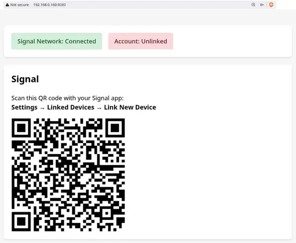
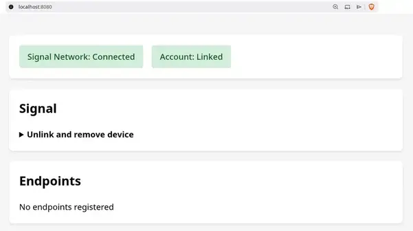
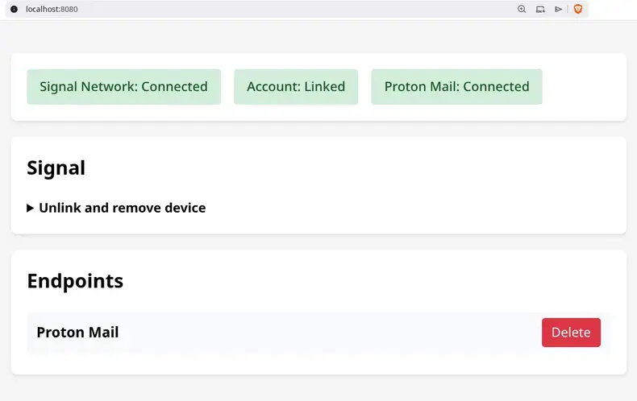

<div align="center">


# SUP

**Push notification system using Signal as transport**

[Setup](#setup) • [Real-World Examples](#real-world-examples) • [Architecture](#architecture)

</div>

<!-- markdownlint-enable MD033 -->

SUP is a self-hosted server that routes push notifications through Signal, allowing you to receive app notifications without exposing unique network fingerprints to any network observers. All notification traffic appears as regular Signal messages.

## How?

SUP functions as a UnifiedPush server to proxy http-based requests to Signal groups via [signal-cli](https://github.com/AsamK/signal-cli).

For the optional Proton Mail integration, SUP requires a server that runs Proton's official [proton-bridge](https://github.com/ProtonMail/proton-bridge). SUP's docker compose process will run an image from [protonmail-bridge-docker](https://github.com/shenxn/protonmail-bridge-docker). Once authenticated, the communication between SUP and proton-bridge will be over IMAP.

## Setup

### 1. Proton Mail Integration

> ⚠️ **Early Alpha**: Currently only `docker-compose.dev.yml` dev deployments are available.

A Proton Mail Bridge is optionally available if you want to receive push notifications for incoming emails.

> **Note:** The default Proton Mail Bridge image uses `shenxn/protonmail-bridge:build` which compiles from source and supports multiple architectures. For x86_64 systems, you can use `shenxn/protonmail-bridge:latest` (pre-built binary, smaller and faster). For ARM devices (Raspberry Pi), stick with `:build`.

To receive Proton Mail notifications via Signal:

1. **Initialize Proton Mail Bridge** (one-time setup):

```bash
# Download docker-compose.yml
curl -L -O https://raw.githubusercontent.com/lone-cloud/sup/master/docker-compose.yml

docker compose run --rm protonmail-bridge init
```

2.**Login to Proton Mail Bridge**:

- At the `>>>` prompt, run: `login`
- Enter your email
- Enter your password
- Enter your 2FA code

3.**Get IMAP credentials**:

- Run: `info`
- Copy the Username and Password shown
- Run: `exit` to quit

4.**Add credentials to .env**:

```bash
# Add these to your .env file
PROTON_IMAP_USERNAME=bridge-username-from-info-command
PROTON_IMAP_PASSWORD=bridge-generated-password-from-info-command
```

5.**Start all services with Proton Mail**:

```bash
docker compose --profile protonmail up -d
```

Your phone will now receive Signal notifications when Proton Mail receives new emails.

Note that the bridge will first need to sync all of your old emails before you can start getting new email notifications which may take a while, but this is a one-time setup.

### 2. Install SUP Server

> ⚠️ **Early Alpha**: Currently only `docker-compose.dev.yml` dev deployments are available.

```bash
# Download docker-compose.yml
curl -L -O https://raw.githubusercontent.com/lone-cloud/sup/master/docker-compose.yml

# Download .env.example (optional)
curl -L -O https://raw.githubusercontent.com/lone-cloud/sup/master/server/.env.example

# Configure SUP server through environment variables (optional)
cp .env.example .env
nano .env

# Start SUP server
docker compose up -d

```

### 3. Link Your Signal Account

Visit <http://localhost:8080> and link your Signal account (one-time setup):

#### 1. Authenticate with your API_KEY


#### 2. Scan the QR code from your Signal app

Go to **Settings → Linked Devices → Link New Device** in Signal.



#### 3. Verify the setup

Once linked, you'll see the status dashboard:



With optional Proton Mail integration:



### Development

For local development, install Bun and signal-cli:

```bash
# Install Bun (use your package manager and this is a backup)
curl -fsSL https://bun.sh/install | bash

git clone https://github.com/lone-cloud/sup.git
cd sup

bun install
cd server
bun start
```

Then build and run with docker-compose.dev.yml:

```bash
docker compose --profile protonmail -f docker-compose.dev.yml up -d
```

or just the proton-bridge:

```bash
docker compose -f docker-compose.dev.yml up protonmail-bridge
```

## Real-World Examples

### Proton Mail Notifications

Receive instant Signal notifications when new emails arrive in your Proton Mail inbox.

SUP monitors your Proton Mail account via the local Proton Mail Bridge and forwards email alerts through Signal. This relies on the same technology that a third-party email client like Thunderbird would be using to integrate with Proton Mail.

### Home Assistant Alerts

Add a rest notification configuration (eg. add to configuration.yaml) to Home Assistant like:

```bash
notify:
  - platform: rest
    name: SUP
    resource: "http://<Your SUP server network IP>/Home Assistant"
    method: POST
    data:
      package: "io.homeassistant.companion.android"
    headers:
      Authorization: !secret sup_basic_auth
```

Note how Home Assistant is also a self-hosted server. As such, it is advisable to turn on `ALLOW_INSECURE_HTTP` environment variable for SUP and to refer to it by its LAN IP address.

Add the Base64 version of your API_KEY environment variable secret to your secrets.yaml. This secret must be prepended by a colon and the simplest way to get this value is to run `btoa(':<API_KEY>')` in your browser's console.

```bash
sup_basic_auth: "Basic <Base64 Hash value>"
```

Reboot your Home Assistant system and you'll then be able to send Signal notifications to yourself by using this notify sup action.  

## Monitoring

The health of the system can be viewed in the same admin UI used for linking Signal. SUP uses [basic access authentication](https://en.wikipedia.org/wiki/Basic_access_authentication) - provide your `API_KEY` as the password (username can be anything).

For API-based monitoring, call `/api/health` which returns JSON:

```json
{"uptime":"3s","signal":{"daemon":"running","linked":true},"protonMail":"connected"}
```

## Architecture


SUP consists of two services that **MUST run together on the same machine**:

- **sup-server** (Bun): Receives webhooks, sends Signal messages via signal-cli. Optional: monitors Proton Mail IMAP
- **protonmail-bridge** (Official Proton, optional): Decrypts Proton Mail emails, runs local IMAP server

All services communicate over a private Docker network with no external exposure except Signal protocol. **Separating these services across multiple machines would expose plaintext IMAP traffic and compromise security.**
